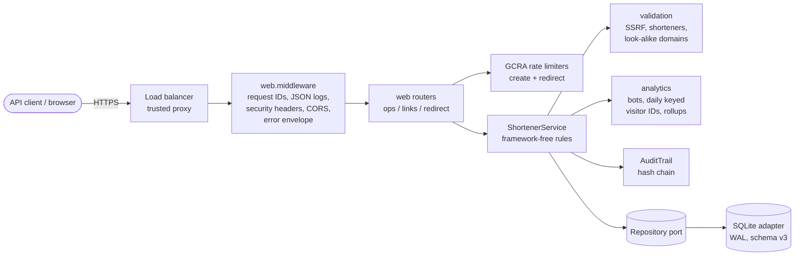
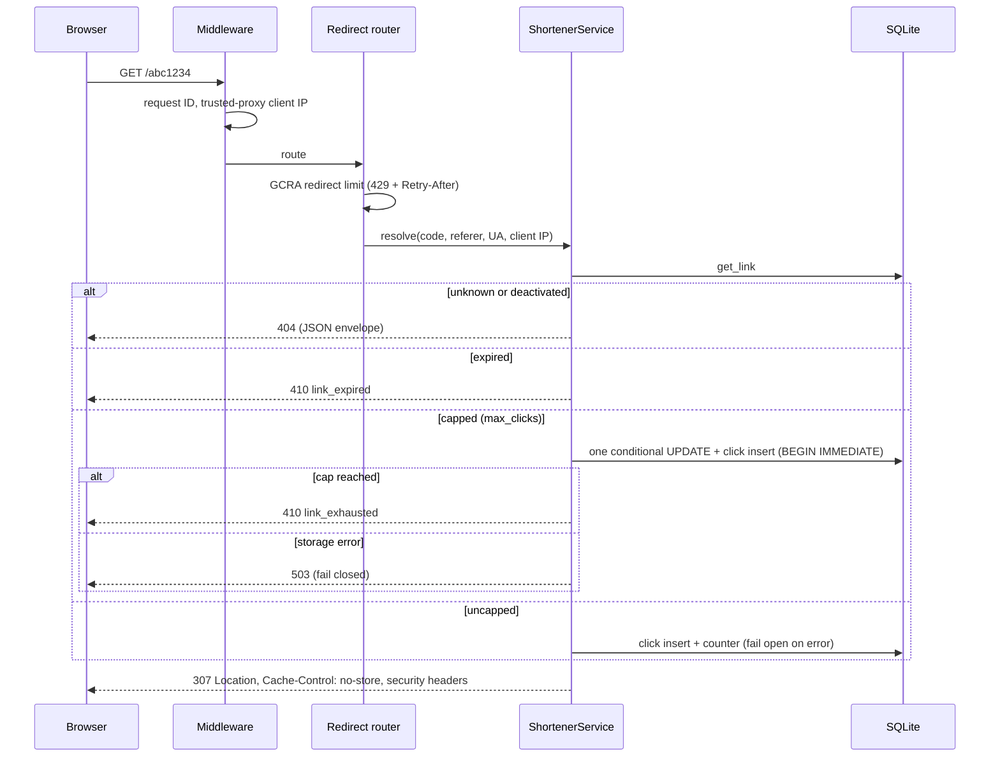
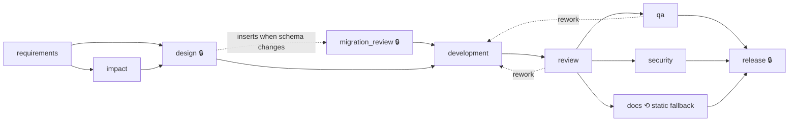

# Design and architecture

The project has two parts:

- **`urlshort/`**: a URL shortener service (core API, analytics, reliability and security features).
- **`sdlc/`**: a governed, agentic SDLC orchestrator that delivered three of the service's features
  through gated stages with human approvals (see `docs/orchestrator.md` and `docs/scenarios.md`).

## 1. Service

### Components

Hexagonal layout: HTTP adapters → framework-free service → repository port. Business rules are tested
without HTTP; storage can be replaced (Postgres is the planned adapter) without touching the service.

### Redirect path (the hot path)

### Data model (schema v3, versioned with `PRAGMA user_version`)

| Table | Purpose | Notes |
|---|---|---|
| `links` | One row per short link | `code` primary key (uniqueness judged by the database); soft delete; `stats_token_hash` (v2), `max_clicks` (v3) |
| `clicks` | One row per redirect | Referrer domain only; browser family; bot flag; `ip_id` keyed visitor ID + `ip_key_id` (v2); never a raw IP |
| `audit_log` | Hash-chained change history | Appended under `BEGIN IMMEDIATE` so concurrent writers cannot fork the chain |

Migrations are expand-only (new nullable columns) and literal SQL; older databases upgrade in place.

### Key decisions

| ADR | Decision | Why | Rejected alternatives |
|---|---|---|---|
| 001 | Hexagonal layout | Rules testable without HTTP; storage swappable | Fat route handlers; ORM-coupled models |
| 002 | Random 7-char base62 codes (CSPRNG), bounded retry | Not enumerable; reveals no volume; 3.5e12 codes | Sequential IDs; URL hashes |
| 003 | 307 + `Cache-Control: no-store` | Every click reaches the service, so analytics are accurate | 301 (cached, loses analytics) |
| 004 | Uncapped click recording fails open; capped links fail closed | Redirect availability outranks analytics, but a cap must never be overspent | Always fail closed; always fail open |
| 005 | GCRA rate limiting behind a `RateLimiter` port | Token-bucket behaviour with one number per client; same algorithm as the planned Redis backend | Fixed window; sliding log |
| 006 | Visitor IDs = HMAC-SHA256 under a daily key | Unique visitors without personal data; not linkable across days | Fixed-salt hash; raw IPs |
| 007 | `max_clicks` enforced by one conditional UPDATE | Check-and-count must be atomic or concurrent clicks overshoot | Read-then-increment (races) |
| 008 | Reject mixed-script hostnames (incl. punycode) | Catches homoglyph phishing without network calls | Brand confusables list; reputation API |
| 009 | `clicks_by_hour` computed at read time | No schema change; rollups planned for scale | Rollup table updated on write |
| 010 | Per-link stats token, stored as SHA-256 | Stats are private by default; a leaked database reveals no usable tokens | Public stats; owner accounts (planned) |
| 011 | Production profile refuses unsafe configuration | Misconfiguration fails at deploy time with every problem listed | Warnings only |

### Security model (STRIDE)

| Threat | Example | Mitigation |
|---|---|---|
| Spoofing | Faking a client IP via `X-Forwarded-For` | Header trusted only from configured proxies, read right to left |
| Tampering | Editing audit history | SHA-256 hash chain; `verify()` detects edits, deletions, reordering |
| Repudiation | Denying a takedown | Audit record with actor and timestamp |
| Information disclosure | Personal data in analytics or logs; reading others' stats | Keyed visitor IDs; log redaction; stats tokens; 401 for unknown codes |
| Denial of service | Mass creation, code scanning | GCRA limits on creates and redirects; bounded memory |
| Elevation / SSRF | Links to internal hosts, phishing via look-alikes or redirect chains | Scheme allow-list; private/link-local IP and `.internal` rejection; shortener and look-alike rejection |

### Reliability and operations

Structured JSON logs on every line (request IDs captured before the non-blocking log queue), liveness and
readiness probes, security headers, a production profile that refuses unsafe settings (one JSON line, exit
code 2), a non-root container with a health check, and CI that tests the real image.

## 2. Orchestrator

### Model

The SDLC is an explicit dependency graph of stages. **Agents do the work; the engine decides whether it
passes.** One coordinator thread owns every state transition; agents run in parallel worker threads.

🔒 = human approval checkpoint. Dashed edges are non-linear paths: rework loops and dynamic stage insertion.

### Control flow per stage

1. **Entry gates:** required artifacts exist.
2. **Snapshot:** file-changing stages take a git snapshot.
3. **Attempt:** the agent runs; transient errors retry with backoff; hard errors switch to the fallback agent.
4. **Exit gates + policy:** missing or failed checks, or a policy *block*, roll back and retry with the
   violations as feedback.
5. **Approval:** required for marked stages, high-impact stages, policy *escalations* and agent requests.
   Approve, reject (rollback), amend (re-plan upstream) or pending (pause, resume later). No default approval.
6. **Commit:** artifacts versioned with lineage; changed outputs invalidate completed downstream stages;
   per-stage generations discard stale results of stages reset while running.

Safe-stop: kill switch, wall-clock and failure budgets, critical-stage failure. Every event is written to a
hash-chained audit log; metrics include success rate, retry and rollback frequency, MTTR and latency.

### Key decisions

| Decision | Why |
|---|---|
| Deterministic agents by default, LLM agents behind the same contract | Reproducible runs and 100% testable governance; the gates must not depend on agents being smart |
| The engine (not agents) evaluates policy and gates | An agent cannot approve itself, skip a gate or touch its own guardrails (`sdlc/` is off limits) |
| Git workspace per run | Atomic rollback to snapshots; real commits that `promote` can bring into the repository |
| Recorded human decisions for demos and CI | Reproducible scenarios; interactive approvals available for real use |
| LLM answers validated against the catalog | A model can only choose known features; anything else falls back, which also defeats prompt injection |

## 3. Limitations and roadmap

See `docs/final-summary.md`. Planned work (in order): Postgres + Redis (cache, Bloom filter, distributed
rate limiting); Kafka-based analytics with an outbox and rollups; owner API keys and a secrets vault;
metrics, tracing and load-test evidence.
