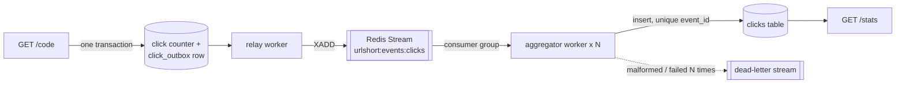

# Event-driven click analytics

Optional: `URLSHORT_ANALYTICS_MODE=events` (or `[analytics] mode = "events"`). The default (`sync`) writes click
details during the redirect, as before.



## Guarantees

| Property | How |
|---|---|
| Counts and caps stay exact and synchronous | The redirect still updates `click_count` (and enforces `max_clicks`) in the database |
| No event is lost | The event is written to `click_outbox` in the **same transaction** as the counter: both or neither |
| No event is double-counted | Delivery is at-least-once; applying is idempotent because `clicks.event_id` is unique |
| A crashed consumer loses nothing | Unacknowledged messages are reclaimed by another consumer after an idle timeout (`XAUTOCLAIM`) |
| Bad events cannot block the pipeline | Malformed events go to the dead-letter stream at once; events that keep failing are retried, then dead-lettered |
| Rebuilding is safe | `replay` re-reads the whole stream; idempotency makes re-application a no-op |

Stats are **eventually consistent** in this mode: a click appears in `/stats` once the aggregator has processed
it (normally well under a second with the workers running). `click_count` on the link is always current.

## Running the workers

```bash
export URLSHORT_REDIS_URL=redis://localhost:6379/0 URLSHORT_DATABASE_URL=postgresql://...   # same storage as the API
python -m urlshort.adapters.workers relay                       # loop
python -m urlshort.adapters.workers aggregate --consumer agg-1  # loop; run several with different names
python -m urlshort.adapters.workers drain                       # one-shot: run both until idle
python -m urlshort.adapters.workers replay                      # rewind the group, then drain
```

`drain` and `replay` print JSON with applied / duplicate / dead counts, stream lag and outbox backlog.

## Event schema (`click.v1`)

`{"type": "click.v1", "event_id", "code", "ts" (UTC ISO 8601), "referrer_host", "agent_family", "is_bot",
"ip_id", "ip_key_id"}`. No raw IPs (the keyed daily visitor ID only), matching the synchronous path.
Unknown types are dead-lettered, so a new version needs a consumer that understands it first.

## Why Redis Streams rather than Kafka

Redis is already part of the stack (cache, rate limits), and Streams provide what this pipeline needs: an
append-only log, consumer groups, acknowledgements, redelivery and replay. Kafka would add a third stateful
system without a need at this scale. The bus is a port (`urlshort.events.EventBus`: publish, read, ack,
dead_letter); a Kafka adapter would map it onto a topic partitioned by short code, a consumer group,
committed offsets and a DLQ topic, with no change to the outbox, relay or aggregator.

## Trade-offs

- Retention: the stream is trimmed approximately to 1M entries; replay reaches back that far (the clicks table
  remains the system of record).
- One relay is recommended; several are safe (duplicates are absorbed) but add redundant work.
- Rollups (per-day, per-hour), HyperLogLog unique visitors and Top-K referrers would move stats off the
  clicks table at higher volumes; the aggregator is where they would be maintained.
