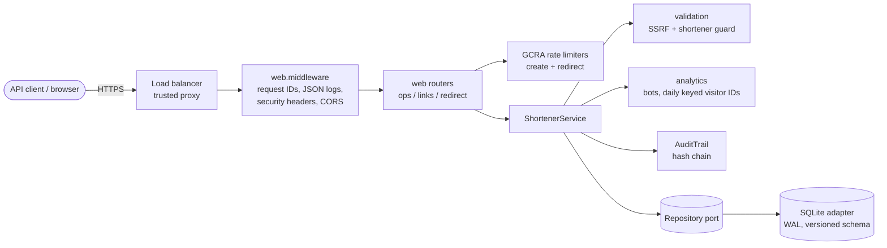
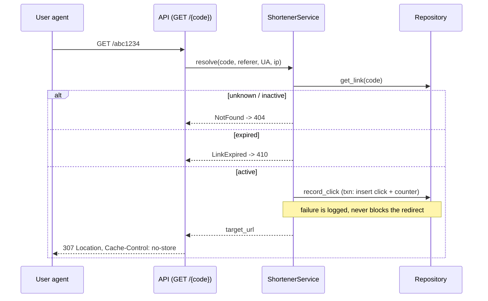

# Design — v0.11 - safer links, richer analytics

## Overview
Stateless HTTP service in a hexagonal layout. Delta design touching urlshort.analytics, urlshort.api, urlshort.config, urlshort.main, urlshort.models, urlshort.service, urlshort.validation, urlshort.web.context, urlshort.web.middleware, urlshort.web.routes_links, urlshort.web.routes_ops, urlshort.web.routes_redirect.

## Component architecture

## Redirect sequence

## API contract
| Method & path | Purpose | Stories |
|---|---|---|
| `GET /api/v1/links/{code}/stats` | see click analytics for my link | US-02, US-04 |
| `POST /api/v1/links` | submit a long URL and receive a short link | US-01, US-03 |

## Data model
- **clicks**
- **links**

## Architecture decisions
- **ADR-008 Reject hostnames that mix Unicode scripts (incl. punycode forms)** — Catches homoglyph phishing (Latin + Cyrillic) without network calls; single-script internationalised names stay valid (rejected: Confusables skeleton vs. a brand list, Reputation API lookup)
- **ADR-009 Compute clicks_by_hour at read time from the clicks table** — No schema change; acceptable at current volumes; rollups planned (rejected: Hourly rollup table updated on write)

## Threat model (STRIDE)
| Threat | Vector | Mitigation |
|---|---|---|
| Spoofing | Unauthenticated takedown requests | Admin API key, constant-time compare (hmac.compare_digest) |
| Tampering | Altering audit history | SHA-256 hash chain; verify() detects edits/reordering |
| Repudiation | Admin denies deactivation | Audit record with actor + timestamp |
| Information disclosure | PII in analytics/logs | Salted IP hash only; policy CMP-001 blocks PII in log calls |
| Denial of service | Mass link creation / code-space exhaustion | Per-client token bucket (429 + Retry-After); bounded collision retries |
| Elevation / SSRF | Short links to internal hosts, credential phishing | Scheme allow-list, private/loopback/link-local IP and *.internal rejection, blocklist |

## Data retention
Clicks retained 400 days then purged (job out of scope for prototype); audit log retained 7 years; only salted IP hashes stored.

## Risks & trade-offs
- SQLite single-writer limits throughput -> Repository port allows Postgres swap
- In-process rate limiter is per-node -> Redis-backed limiter for multi-node
- Synchronous click write on redirect path -> move to async queue at scale (NFR-1)
