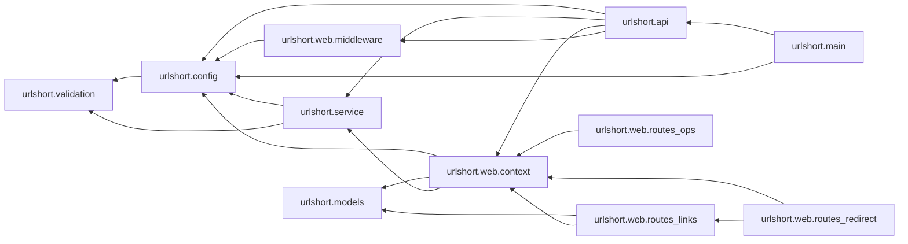

# Impact analysis

**Risk:** medium  |  **Schema change:** False

**Concepts searched:** StatsResponse, create_link, shorten, stats, summarise, validate_url

| Category | Items |
|---|---|
| Seed modules (direct) | urlshort.analytics, urlshort.models, urlshort.service, urlshort.validation, urlshort.web.routes_links |
| Impacted (reverse import closure) | urlshort.analytics, urlshort.api, urlshort.config, urlshort.main, urlshort.models, urlshort.service, urlshort.validation, urlshort.web.context, urlshort.web.middleware, urlshort.web.routes_links, urlshort.web.routes_ops, urlshort.web.routes_redirect |
| API routes | POST /api/v1/links, GET /api/v1/links/{code}/stats |
| Tables | clicks, links |
| Tests to update | tests/service/conftest.py, tests/service/test_analytics.py, tests/service/test_api.py, tests/service/test_config.py, tests/service/test_health.py, tests/service/test_main.py, tests/service/test_max_clicks.py, tests/service/test_production.py, tests/service/test_service.py, tests/service/test_validation.py |
| Approved change scope | CHANGELOG.md, RELEASE_NOTES.md, VERSION, docs/*, docs/**, tests/*, tests/**, urlshort/analytics.py, urlshort/models.py, urlshort/service.py, urlshort/validation.py, urlshort/web/routes_links.py |

## Dependency subgraph (impacted modules)

