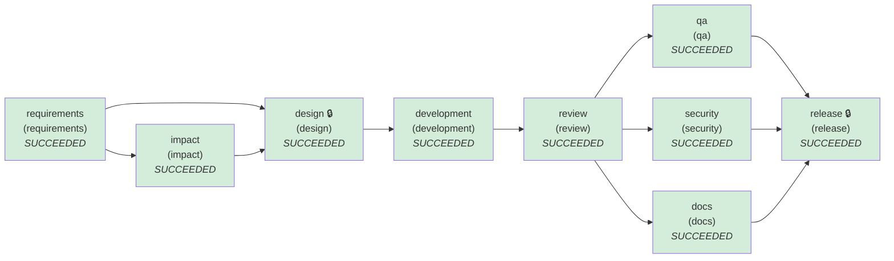

# SDLC run report — ambiguous

- **Run id:** `ambiguous`  
- **Final status:** **COMPLETED**  
- **Audit chain verified:** True (47 hash-chained events)

## Stage graph (final state)


Parallel waves: [requirements] → [impact] → [design] → [development] → [review] → [docs, qa, security] → [release]

## Stages
| Stage | Agent | Status | Attempts | Retries | Rollbacks | Fallbacks | Reworks | Note |
|---|---|---|---|---|---|---|---|---|
| requirements | requirements | SUCCEEDED | 3 | 0 | 0 | 0 | 0 |  |
| impact | impact | SUCCEEDED | 2 | 0 | 0 | 0 | 0 |  |
| design | design | SUCCEEDED | 2 | 0 | 0 | 0 | 0 |  |
| development | development | SUCCEEDED | 1 | 0 | 0 | 0 | 0 |  |
| review | review | SUCCEEDED | 1 | 0 | 0 | 0 | 0 |  |
| docs | docs → docs_static | SUCCEEDED | 1 | 0 | 0 | 0 | 0 |  |
| qa | qa | SUCCEEDED | 1 | 0 | 0 | 0 | 0 |  |
| security | security | SUCCEEDED | 1 | 0 | 0 | 0 | 0 |  |
| release | release | SUCCEEDED | 1 | 0 | 0 | 0 | 0 |  |

## Human approval checkpoints
| Checkpoint | Decision | Approver | Reason | Comment |
|---|---|---|---|---|
| requirements#1 | **amend** | priya.product-owner | agent escalation: assumptions made for ['safer', 'track more']; requester must confirm; unresolved ambiguity ['more stuff', 'fast']: requester must clarify | 'More stuff' means the time-of-day view. 'Fast' is already NFR-1; no new work. |
| requirements#2 | **approved** | priya.product-owner | agent escalation: assumptions made for ['safer', 'track more']; requester must confirm | Assumptions accepted for now: safer = security headers, track more = hourly. |
| design#1 | **amend** | sam.security-lead | stage requires human sign-off | Headers already exist. Our real incidents are phishing links on look-alike domains. Re-scope 'safer'. |
| requirements#3 | **approved** | priya.product-owner | agent escalation: assumptions made for ['track more']; requester must confirm | Confirmed with the security lead. |
| design#2 | **approved** | sam.security-lead | stage requires human sign-off | ADR-008 accepted: no network calls on create. |
| release#1 | **approved** | raj.release-manager | stage requires human sign-off | high-impact stage | Ship v0.11.0. |

## Policy guardrail evaluations
| Stage | Outcome | Violations |
|---|---|---|
| requirements | allow | — |
| requirements | allow | — |
| impact | allow | — |
| design | allow | — |
| requirements | allow | — |
| impact | allow | — |
| design | allow | — |
| development | allow | — |
| review | allow | — |
| security | allow | — |
| docs | allow | — |
| qa | allow | — |
| release | allow | — |

## Re-planning & recovery events
- `18:36:43` **replan.amend** requirements — {"target": "requirements", "inputs": {"clarifications": {"more stuff": "hourly", "fast": "No new work: covered by NFR-1 (p99 < 50 ms)"}}}
- `18:36:43` **replan.amend** design — {"target": "requirements", "inputs": {"clarifications": {"more stuff": "hourly", "fast": "No new work: covered by NFR-1 (p99 < 50 ms)", "safer": "lookalike"}}}

## Decisions (lineage)
| Id | Stage | Decision | Rationale | By |
|---|---|---|---|---|
| D001 | requirements | Human amended inputs of 'requirements' | 'More stuff' means the time-of-day view. 'Fast' is already NFR-1; no new work. | priya.product-owner |
| D002 | requirements | Approved requirements#2 | Assumptions accepted for now: safer = security headers, track more = hourly. | priya.product-owner |
| D003 | requirements | Interpret 'safer' as 'headers' | agent assumption (needs sign-off) | agent |
| D004 | requirements | Interpret 'track more' as 'hourly' | agent assumption (needs sign-off) | agent |
| D005 | requirements | Interpret 'more stuff' as 'hourly' | human clarification | agent |
| D006 | impact | Change scope limited to 12 path patterns | derived from AST symbol/import analysis; enforced by CHG-003 | agent |
| D007 | design | Human amended inputs of 'requirements' | Headers already exist. Our real incidents are phishing links on look-alike domains. Re-scope 'safer'. | sam.security-lead |
| D008 | requirements | Approved requirements#3 | Confirmed with the security lead. | priya.product-owner |
| D009 | requirements | Interpret 'safer' as 'lookalike' | human clarification | agent |
| D010 | requirements | Interpret 'track more' as 'hourly' | agent assumption (needs sign-off) | agent |
| D011 | requirements | Interpret 'more stuff' as 'hourly' | human clarification | agent |
| D012 | impact | Change scope limited to 12 path patterns | derived from AST symbol/import analysis; enforced by CHG-003 | agent |
| D013 | design | Approved design#2 | ADR-008 accepted: no network calls on create. | sam.security-lead |
| D014 | design | ADR-008 Reject hostnames that mix Unicode scripts (incl. punycode forms) | Catches homoglyph phishing (Latin + Cyrillic) without network calls; single-script internationalised names stay valid | agent |
| D015 | design | ADR-009 Compute clicks_by_hour at read time from the clicks table | No schema change; acceptable at current volumes; rollups planned | agent |
| D016 | release | Approved release#1 | Ship v0.11.0. | raj.release-manager |

## Provenance of `release`
```
release@93de3d4bbf6bfa48
  qa_report@483bc07532d99b12
    review_report@ed86678a4a00805a
      code_change@284109e61dfd22c5
        design@541f303dbc8e3fb1
          requirements@de4f3e5cf4e4b57a
          impact@0b6822a79c12530d
            requirements@de4f3e5cf4e4b57a
  security_report@db79c66a4d7d329d
    review_report@ed86678a4a00805a
      code_change@284109e61dfd22c5
        design@541f303dbc8e3fb1
          requirements@de4f3e5cf4e4b57a
          impact@0b6822a79c12530d
            requirements@de4f3e5cf4e4b57a
  docs@c36f8eae3ebda580
    review_report@ed86678a4a00805a
      code_change@284109e61dfd22c5
        design@541f303dbc8e3fb1
          requirements@de4f3e5cf4e4b57a
          impact@0b6822a79c12530d
            requirements@de4f3e5cf4e4b57a
```

## Reliability metrics
| Metric | Value |
|---|---|
| attempts | 13 |
| attempt_success_rate | 1.0 |
| retries | 0 |
| rollbacks | 0 |
| fallbacks | 0 |
| reworks | 0 |
| retry_frequency | 0.0 |
| rollback_frequency | 0.0 |
| incidents_recovered | 0 |
| mttr_seconds | None |
| end_to_end_latency_seconds | 9.886 |

## Timeline
| Time (UTC) | Event | Stage | Actor |
|---|---|---|---|
| 18:36:43.730 | run.start |  | orchestrator |
| 18:36:43.730 | stage.start | requirements | orchestrator |
| 18:36:43.731 | policy.evaluated | requirements | orchestrator |
| 18:36:43.731 | approval.decision | requirements | priya.product-owner |
| 18:36:43.731 | replan.amend | requirements | priya.product-owner |
| 18:36:43.731 | stage.start | requirements | orchestrator |
| 18:36:43.731 | policy.evaluated | requirements | orchestrator |
| 18:36:43.731 | approval.decision | requirements | priya.product-owner |
| 18:36:43.732 | stage.succeeded | requirements | orchestrator |
| 18:36:43.732 | stage.start | impact | orchestrator |
| 18:36:43.793 | policy.evaluated | impact | orchestrator |
| 18:36:43.793 | stage.succeeded | impact | orchestrator |
| 18:36:43.794 | stage.start | design | orchestrator |
| 18:36:43.794 | policy.evaluated | design | orchestrator |
| 18:36:43.794 | approval.decision | design | sam.security-lead |
| 18:36:43.794 | replan.amend | design | sam.security-lead |
| 18:36:43.794 | stage.start | requirements | orchestrator |
| 18:36:43.794 | policy.evaluated | requirements | orchestrator |
| 18:36:43.795 | approval.decision | requirements | priya.product-owner |
| 18:36:43.795 | stage.succeeded | requirements | orchestrator |
| 18:36:43.795 | stage.start | impact | orchestrator |
| 18:36:43.852 | policy.evaluated | impact | orchestrator |
| 18:36:43.852 | stage.succeeded | impact | orchestrator |
| 18:36:43.852 | stage.start | design | orchestrator |
| 18:36:43.852 | policy.evaluated | design | orchestrator |
| 18:36:43.853 | approval.decision | design | sam.security-lead |
| 18:36:43.853 | stage.succeeded | design | orchestrator |
| 18:36:43.853 | stage.start | development | orchestrator |
| 18:36:43.920 | policy.evaluated | development | orchestrator |
| 18:36:43.924 | stage.succeeded | development | orchestrator |
| 18:36:43.924 | stage.start | review | orchestrator |
| 18:36:43.944 | policy.evaluated | review | orchestrator |
| 18:36:43.945 | stage.succeeded | review | orchestrator |
| 18:36:43.945 | stage.start | docs | orchestrator |
| 18:36:43.945 | stage.start | qa | orchestrator |
| 18:36:43.945 | stage.start | security | orchestrator |
| 18:36:44.020 | policy.evaluated | security | orchestrator |
| 18:36:44.020 | stage.succeeded | security | orchestrator |
| 18:36:45.012 | policy.evaluated | docs | orchestrator |
| 18:36:45.035 | stage.succeeded | docs | orchestrator |
| 18:36:53.585 | policy.evaluated | qa | orchestrator |
| 18:36:53.585 | stage.succeeded | qa | orchestrator |
| 18:36:53.586 | stage.start | release | orchestrator |
| 18:36:53.603 | policy.evaluated | release | orchestrator |
| 18:36:53.603 | approval.decision | release | raj.release-manager |
| 18:36:53.615 | stage.succeeded | release | orchestrator |
| 18:36:53.616 | run.end |  | orchestrator |
