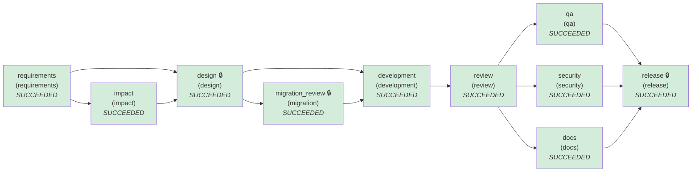

# SDLC run report — brownfield

- **Run id:** `brownfield`  
- **Final status:** **COMPLETED**  
- **Audit chain verified:** True (51 hash-chained events)

## Stage graph (final state)


Parallel waves: [requirements] → [impact] → [design] → [migration_review] → [development] → [review] → [docs, qa, security] → [release]

## Stages
| Stage | Agent | Status | Attempts | Retries | Rollbacks | Fallbacks | Reworks | Note |
|---|---|---|---|---|---|---|---|---|
| requirements | requirements | SUCCEEDED | 1 | 0 | 0 | 0 | 0 |  |
| impact | impact | SUCCEEDED | 1 | 0 | 0 | 0 | 0 |  |
| design | design | SUCCEEDED | 1 | 0 | 0 | 0 | 0 |  |
| migration_review | migration | SUCCEEDED | 1 | 0 | 0 | 0 | 0 |  |
| development | development | SUCCEEDED | 3 | 1 | 2 | 0 | 1 |  |
| review | review | SUCCEEDED | 2 | 0 | 0 | 0 | 0 |  |
| docs | docs → docs_static | SUCCEEDED | 2 | 0 | 1 | 1 | 0 |  |
| qa | qa | SUCCEEDED | 1 | 0 | 0 | 0 | 0 |  |
| security | security | SUCCEEDED | 1 | 0 | 0 | 0 | 0 |  |
| release | release | SUCCEEDED | 1 | 0 | 0 | 0 | 0 |  |

## Human approval checkpoints
| Checkpoint | Decision | Approver | Reason | Comment |
|---|---|---|---|---|
| design#1 | **approved** | jane.architect | stage requires human sign-off | ADR-007 accepted: atomic conditional UPDATE; capped links fail closed. |
| migration_review#1 | **approved** | dba.omar | stage requires human sign-off | high-impact stage | Additive nullable column, expand-only, rollback defined. |
| development#1 | **approved** | jane.architect | policy escalation: [CHG-002] protected path (security boundary, schema or build) changed; human approval required urlshort/storage.py | storage.py change matches the approved migration plan; code quality is review's job. |
| development#2 | **approved** | jane.architect | policy escalation: [CHG-002] protected path (security boundary, schema or build) changed; human approval required urlshort/storage.py | Re-approved after rework; schema scope unchanged. |
| release#1 | **approved** | raj.release-manager | stage requires human sign-off | high-impact stage | Docs came from the static fallback; acceptable. Ship v0.10.0. |

## Policy guardrail evaluations
| Stage | Outcome | Violations |
|---|---|---|
| requirements | allow | — |
| impact | allow | — |
| design | allow | — |
| migration_review | allow | — |
| development | block | CHG-002 (escalate) protected path (security boundary, schema or build) changed; human approval required `urlshort/storage.py`<br/>SEC-003 (block) SQL built with string formatting; use parameters `urlshort/storage.py:249` |
| development | escalate | CHG-002 (escalate) protected path (security boundary, schema or build) changed; human approval required `urlshort/storage.py` |
| review | allow | — |
| development | escalate | CHG-002 (escalate) protected path (security boundary, schema or build) changed; human approval required `urlshort/storage.py` |
| review | allow | — |
| security | allow | — |
| docs | allow | — |
| qa | allow | — |
| release | allow | — |

## Re-planning & recovery events
- `18:36:29` **replan.insert** design — {"new": "migration_review", "before": ["development"]}
- `18:36:30` **stage.attempt_failed** development — {"attempt": 1, "reason": "policy: [CHG-002] protected path (security boundary, schema or build) changed; human approval required urlshort/storage.py; policy: [SEC-003] SQL built with string formatting; use parameters urlshort/storage.py:249", "will_retry": true}
- `18:36:30` **stage.rollback** development — {"to": "5c63b474c0286594e41b68caf8d2a23e0cce75c6"}
- `18:36:30` **replan.rework** review — {"target": "development", "round": 1, "feedback": ["RV-001 urlshort/service.py:105 (resolve) exception swallowed silently (no log/re-raise)"]}
- `18:36:30` **stage.rollback** development — {"to": "pre-stage snapshot", "reason": "rework requested by review"}
- `18:36:30` **stage.attempt_failed** docs — {"attempt": 1, "reason": "AgentError: injected hard failure in docs", "will_retry": false}
- `18:36:30` **stage.rollback** docs — {"to": "76eee9e5053a33357cff9cd7046f0d61e896a126"}
- `18:36:30` **stage.fallback** docs — {"agent": "docs_static", "after": "AgentError: injected hard failure in docs"}

## Decisions (lineage)
| Id | Stage | Decision | Rationale | By |
|---|---|---|---|---|
| D001 | impact | Change scope limited to 16 path patterns | derived from AST symbol/import analysis; enforced by CHG-003 | agent |
| D002 | design | Approved design#1 | ADR-007 accepted: atomic conditional UPDATE; capped links fail closed. | jane.architect |
| D003 | design | ADR-007 Enforce max_clicks with one conditional UPDATE at redirect time | Check-and-count must be atomic or concurrent clicks overshoot the cap; bots must not consume it; capped links fail closed | agent |
| D004 | migration_review | Approved migration_review#1 | Additive nullable column, expand-only, rollback defined. | dba.omar |
| D005 | development | Approved development#1 | storage.py change matches the approved migration plan; code quality is review's job. | jane.architect |
| D006 | development | Approved development#2 | Re-approved after rework; schema scope unchanged. | jane.architect |
| D007 | release | Approved release#1 | Docs came from the static fallback; acceptable. Ship v0.10.0. | raj.release-manager |

## Provenance of `release`
```
release@38d9668809cc44ea
  qa_report@78901a4c9a0897c5
    review_report@254dfc52bc921449
      code_change@66590c6a065587ec
        design@d640896b7acbc787
          requirements@f126202b5fde5f8b
          impact@7fd7409266de117b
            requirements@f126202b5fde5f8b
        migration_plan@787726f97717cea7
          design@d640896b7acbc787
            requirements@f126202b5fde5f8b
            impact@7fd7409266de117b
              requirements@f126202b5fde5f8b
  security_report@db79c66a4d7d329d
    review_report@254dfc52bc921449
      code_change@66590c6a065587ec
        design@d640896b7acbc787
          requirements@f126202b5fde5f8b
          impact@7fd7409266de117b
            requirements@f126202b5fde5f8b
        migration_plan@787726f97717cea7
          design@d640896b7acbc787
            requirements@f126202b5fde5f8b
            impact@7fd7409266de117b
              requirements@f126202b5fde5f8b
  docs@6284c656bf1158f9
    review_report@254dfc52bc921449
      code_change@66590c6a065587ec
        design@d640896b7acbc787
          requirements@f126202b5fde5f8b
          impact@7fd7409266de117b
            requirements@f126202b5fde5f8b
        migration_plan@787726f97717cea7
          design@d640896b7acbc787
            requirements@f126202b5fde5f8b
            impact@7fd7409266de117b
              requirements@f126202b5fde5f8b
```

## Reliability metrics
| Metric | Value |
|---|---|
| attempts | 14 |
| attempt_success_rate | 0.857 |
| retries | 1 |
| rollbacks | 3 |
| fallbacks | 1 |
| reworks | 1 |
| retry_frequency | 0.071 |
| rollback_frequency | 0.214 |
| incidents_recovered | 2 |
| mttr_seconds | 0.163 |
| end_to_end_latency_seconds | 8.711 |

## Timeline
| Time (UTC) | Event | Stage | Actor |
|---|---|---|---|
| 18:36:29.935 | run.start |  | orchestrator |
| 18:36:29.935 | stage.start | requirements | orchestrator |
| 18:36:29.936 | policy.evaluated | requirements | orchestrator |
| 18:36:29.936 | stage.succeeded | requirements | orchestrator |
| 18:36:29.936 | stage.start | impact | orchestrator |
| 18:36:29.990 | policy.evaluated | impact | orchestrator |
| 18:36:29.991 | stage.succeeded | impact | orchestrator |
| 18:36:29.991 | stage.start | design | orchestrator |
| 18:36:29.991 | policy.evaluated | design | orchestrator |
| 18:36:29.991 | approval.decision | design | jane.architect |
| 18:36:29.992 | stage.succeeded | design | orchestrator |
| 18:36:29.992 | replan.insert | design | orchestrator |
| 18:36:29.992 | stage.start | migration_review | orchestrator |
| 18:36:29.992 | policy.evaluated | migration_review | orchestrator |
| 18:36:29.992 | approval.decision | migration_review | dba.omar |
| 18:36:29.992 | stage.succeeded | migration_review | orchestrator |
| 18:36:29.992 | stage.start | development | orchestrator |
| 18:36:30.064 | policy.evaluated | development | orchestrator |
| 18:36:30.064 | stage.attempt_failed | development | orchestrator |
| 18:36:30.070 | stage.rollback | development | orchestrator |
| 18:36:30.182 | policy.evaluated | development | orchestrator |
| 18:36:30.183 | approval.decision | development | jane.architect |
| 18:36:30.188 | stage.succeeded | development | orchestrator |
| 18:36:30.188 | stage.start | review | orchestrator |
| 18:36:30.217 | policy.evaluated | review | orchestrator |
| 18:36:30.218 | replan.rework | review | orchestrator |
| 18:36:30.225 | stage.rollback | development | orchestrator |
| 18:36:30.225 | stage.start | development | orchestrator |
| 18:36:30.298 | policy.evaluated | development | orchestrator |
| 18:36:30.298 | approval.decision | development | jane.architect |
| 18:36:30.304 | stage.succeeded | development | orchestrator |
| 18:36:30.304 | stage.start | review | orchestrator |
| 18:36:30.333 | policy.evaluated | review | orchestrator |
| 18:36:30.333 | stage.succeeded | review | orchestrator |
| 18:36:30.333 | stage.start | docs | orchestrator |
| 18:36:30.333 | stage.start | qa | orchestrator |
| 18:36:30.334 | stage.start | security | orchestrator |
| 18:36:30.404 | stage.attempt_failed | docs | orchestrator |
| 18:36:30.406 | policy.evaluated | security | orchestrator |
| 18:36:30.407 | stage.succeeded | security | orchestrator |
| 18:36:30.413 | stage.rollback | docs | orchestrator |
| 18:36:30.413 | stage.fallback | docs | orchestrator |
| 18:36:30.547 | policy.evaluated | docs | orchestrator |
| 18:36:30.571 | stage.succeeded | docs | orchestrator |
| 18:36:38.613 | policy.evaluated | qa | orchestrator |
| 18:36:38.614 | stage.succeeded | qa | orchestrator |
| 18:36:38.614 | stage.start | release | orchestrator |
| 18:36:38.633 | policy.evaluated | release | orchestrator |
| 18:36:38.633 | approval.decision | release | raj.release-manager |
| 18:36:38.646 | stage.succeeded | release | orchestrator |
| 18:36:38.647 | run.end |  | orchestrator |
