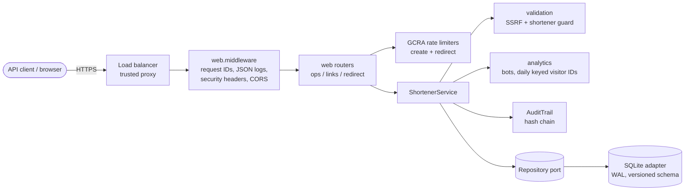
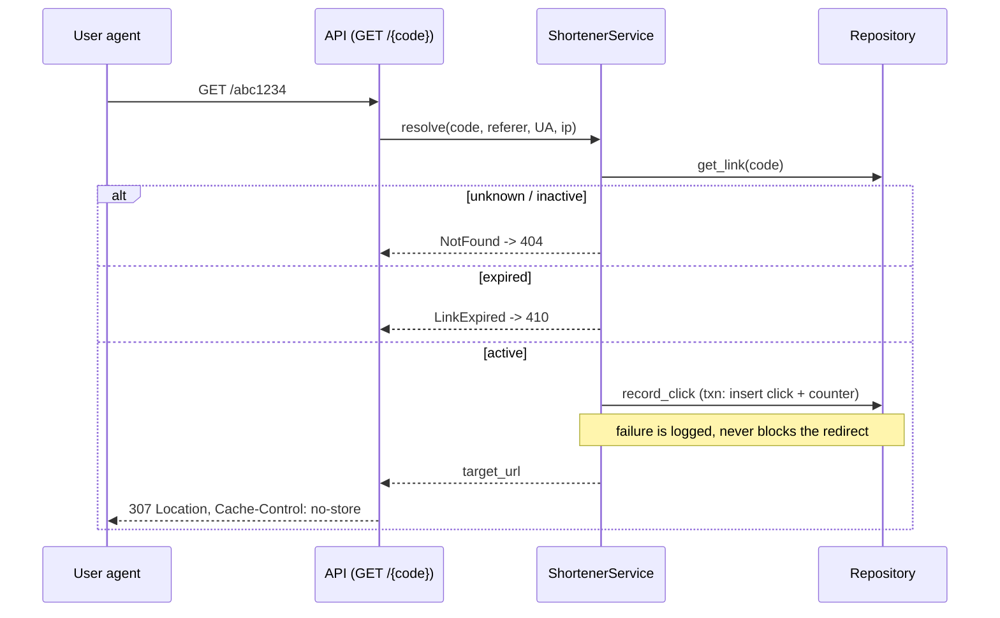

# Design — URL shortener v0.9

## Overview
Stateless HTTP service in a hexagonal layout. Greenfield build of all components below.

## Component architecture

## Redirect sequence

## API contract
| Method & path | Purpose | Stories |
|---|---|---|
| `DELETE /api/v1/links/{code}` | deactivate a link | US-07 |
| `GET /api/v1/links/{code}/stats` | see click analytics for my link | US-05 |
| `GET /livez` | probe liveness and readiness | US-08 |
| `GET /readyz` | probe liveness and readiness | US-08 |
| `GET /{code}` | open a short link and land on the target | US-02, US-04, US-06 |
| `POST /api/v1/links` | submit a long URL and receive a short link | US-01, US-03, US-04, US-06, US-10 |

## Data model
- **audit_log**
- **clicks**
- **links**

## Architecture decisions
- **ADR-001 Hexagonal layout: web routers -> framework-free service -> Repository port** — Business rules testable without HTTP; storage swappable (SQLite now, Postgres planned) (rejected: Fat route handlers, ORM-coupled models)
- **ADR-002 Random 7-char base62 codes from a CSPRNG with bounded collision retry** — Non-enumerable (privacy) and reveals no volume; 62^7 = 3.5e12 codes (rejected: Auto-increment + base62, Hash of the URL)
- **ADR-003 307 redirect with Cache-Control: no-store** — Every click reaches the service, so analytics are accurate; 301 would be cached by browsers (rejected: 301 (cheaper, loses analytics), 302)
- **ADR-004 Uncapped click recording fails open; capped links fail closed** — Availability of redirects outranks analytics completeness, but a limit must never be overspent (rejected: Always fail closed, Async queue (planned for scale-out))
- **ADR-005 GCRA rate limiting behind a RateLimiter port** — Token-bucket behaviour with one number per client; same algorithm as the planned Redis backend (rejected: Fixed window, Sliding-window log)
- **ADR-006 Visitor IDs are HMAC-SHA256 under a daily key; raw IPs never stored** — Counts unique visitors per day without personal data at rest; visitors not linkable across days (rejected: Salted hash with a fixed salt, Store raw IPs)

## Threat model (STRIDE)
| Threat | Vector | Mitigation |
|---|---|---|
| Spoofing | Unauthenticated takedown requests | Admin API key, constant-time compare (hmac.compare_digest) |
| Tampering | Altering audit history | SHA-256 hash chain; verify() detects edits/reordering |
| Repudiation | Admin denies deactivation | Audit record with actor + timestamp |
| Information disclosure | PII in analytics/logs | Salted IP hash only; policy CMP-001 blocks PII in log calls |
| Denial of service | Mass link creation / code-space exhaustion | Per-client token bucket (429 + Retry-After); bounded collision retries |
| Elevation / SSRF | Short links to internal hosts, credential phishing | Scheme allow-list, private/loopback/link-local IP and *.internal rejection, blocklist |

## Data retention
Clicks retained 400 days then purged (job out of scope for prototype); audit log retained 7 years; only salted IP hashes stored.

## Risks & trade-offs
- SQLite single-writer limits throughput -> Repository port allows Postgres swap
- In-process rate limiter is per-node -> Redis-backed limiter for multi-node
- Synchronous click write on redirect path -> move to async queue at scale (NFR-1)
