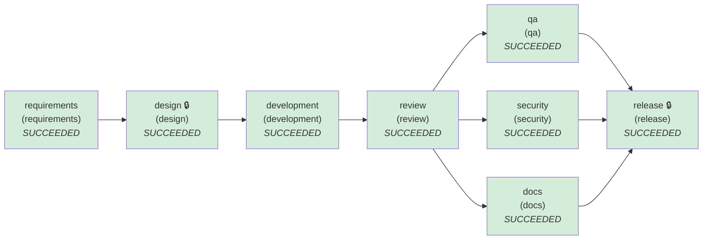

# SDLC run report — greenfield

- **Run id:** `greenfield`  
- **Final status:** **COMPLETED**  
- **Audit chain verified:** True (30 hash-chained events)

## Stage graph (final state)


Parallel waves: [requirements] → [design] → [development] → [review] → [docs, qa, security] → [release]

## Stages
| Stage | Agent | Status | Attempts | Retries | Rollbacks | Fallbacks | Reworks | Note |
|---|---|---|---|---|---|---|---|---|
| requirements | requirements | SUCCEEDED | 1 | 0 | 0 | 0 | 0 |  |
| design | design | SUCCEEDED | 1 | 0 | 0 | 0 | 0 |  |
| development | development | SUCCEEDED | 1 | 0 | 0 | 0 | 0 |  |
| review | review | SUCCEEDED | 1 | 0 | 0 | 0 | 0 |  |
| docs | docs → docs_static | SUCCEEDED | 1 | 0 | 0 | 0 | 0 |  |
| qa | qa | SUCCEEDED | 2 | 1 | 0 | 0 | 0 |  |
| security | security | SUCCEEDED | 1 | 0 | 0 | 0 | 0 |  |
| release | release | SUCCEEDED | 1 | 0 | 0 | 0 | 0 |  |

## Human approval checkpoints
| Checkpoint | Decision | Approver | Reason | Comment |
|---|---|---|---|---|
| design#1 | **approved** | jane.architect | stage requires human sign-off | Hexagonal layout, STRIDE mitigations and ADRs accepted. |
| development#1 | **approved** | jane.architect | policy escalation: [CHG-002] protected path (security boundary, schema or build) changed; human approval required pyproject.toml; [CHG-002] protected path (security boundary, schema or build) changed; human approval required requirements.txt; [CHG-002] protected path (security boundary, schema or build) changed; human approval required urlshort/config.py; [CHG-002] protected path (security boundary, schema or build) changed; human approval required urlshort/storage.py; [CHG-002] protected path (security boundary, schema or build) changed; human approval required urlshort/web/clientip.py; [CHG-002] protected path (security boundary, schema or build) changed; human approval required urlshort/web/middleware.py; [CHG-005] large change (45 authored files, 3643 lines) | Full build touches protected paths (schema, config, deps) and is large by nature; reviewed. |
| release#1 | **approved** | raj.release-manager | stage requires human sign-off | high-impact stage | All readiness checks green. |

## Policy guardrail evaluations
| Stage | Outcome | Violations |
|---|---|---|
| requirements | allow | — |
| design | allow | — |
| development | escalate | CHG-002 (escalate) protected path (security boundary, schema or build) changed; human approval required `pyproject.toml`<br/>CHG-002 (escalate) protected path (security boundary, schema or build) changed; human approval required `requirements.txt`<br/>CHG-002 (escalate) protected path (security boundary, schema or build) changed; human approval required `urlshort/config.py`<br/>CHG-002 (escalate) protected path (security boundary, schema or build) changed; human approval required `urlshort/storage.py`<br/>CHG-002 (escalate) protected path (security boundary, schema or build) changed; human approval required `urlshort/web/clientip.py`<br/>CHG-002 (escalate) protected path (security boundary, schema or build) changed; human approval required `urlshort/web/middleware.py`<br/>CHG-005 (escalate) large change (45 authored files, 3643 lines) `` |
| review | allow | — |
| security | allow | — |
| docs | allow | — |
| qa | allow | — |
| release | allow | — |

## Re-planning & recovery events
- `18:35:32` **stage.attempt_failed** qa — {"attempt": 1, "reason": "transient: injected transient fault #1 in qa", "will_retry": true}

## Decisions (lineage)
| Id | Stage | Decision | Rationale | By |
|---|---|---|---|---|
| D001 | design | Approved design#1 | Hexagonal layout, STRIDE mitigations and ADRs accepted. | jane.architect |
| D002 | design | ADR-001 Hexagonal layout: web routers -> framework-free service -> Repository port | Business rules testable without HTTP; storage swappable (SQLite now, Postgres planned) | agent |
| D003 | design | ADR-002 Random 7-char base62 codes from a CSPRNG with bounded collision retry | Non-enumerable (privacy) and reveals no volume; 62^7 = 3.5e12 codes | agent |
| D004 | design | ADR-003 307 redirect with Cache-Control: no-store | Every click reaches the service, so analytics are accurate; 301 would be cached by browsers | agent |
| D005 | design | ADR-004 Uncapped click recording fails open; capped links fail closed | Availability of redirects outranks analytics completeness, but a limit must never be overspent | agent |
| D006 | design | ADR-005 GCRA rate limiting behind a RateLimiter port | Token-bucket behaviour with one number per client; same algorithm as the planned Redis backend | agent |
| D007 | design | ADR-006 Visitor IDs are HMAC-SHA256 under a daily key; raw IPs never stored | Counts unique visitors per day without personal data at rest; visitors not linkable across days | agent |
| D008 | development | Approved development#1 | Full build touches protected paths (schema, config, deps) and is large by nature; reviewed. | jane.architect |
| D009 | release | Approved release#1 | All readiness checks green. | raj.release-manager |

## Provenance of `release`
```
release@33ef586e64a5a63e
  qa_report@e9ed8acd69c25933
    review_report@b4634389ca76cbaa
      code_change@a845ca2dacda4e89
        design@28023433645fce2e
          requirements@c35d42ec1d1709a4
  security_report@db79c66a4d7d329d
    review_report@b4634389ca76cbaa
      code_change@a845ca2dacda4e89
        design@28023433645fce2e
          requirements@c35d42ec1d1709a4
  docs@c36f8eae3ebda580
    review_report@b4634389ca76cbaa
      code_change@a845ca2dacda4e89
        design@28023433645fce2e
          requirements@c35d42ec1d1709a4
```

## Reliability metrics
| Metric | Value |
|---|---|
| attempts | 9 |
| attempt_success_rate | 0.889 |
| retries | 1 |
| rollbacks | 0 |
| fallbacks | 0 |
| reworks | 0 |
| retry_frequency | 0.111 |
| rollback_frequency | 0.0 |
| incidents_recovered | 1 |
| mttr_seconds | 8.626 |
| end_to_end_latency_seconds | 8.984 |

## Timeline
| Time (UTC) | Event | Stage | Actor |
|---|---|---|---|
| 18:35:32.612 | run.start |  | orchestrator |
| 18:35:32.612 | stage.start | requirements | orchestrator |
| 18:35:32.613 | policy.evaluated | requirements | orchestrator |
| 18:35:32.613 | stage.succeeded | requirements | orchestrator |
| 18:35:32.613 | stage.start | design | orchestrator |
| 18:35:32.614 | policy.evaluated | design | orchestrator |
| 18:35:32.614 | approval.decision | design | jane.architect |
| 18:35:32.614 | stage.succeeded | design | orchestrator |
| 18:35:32.614 | stage.start | development | orchestrator |
| 18:35:32.806 | policy.evaluated | development | orchestrator |
| 18:35:32.806 | approval.decision | development | jane.architect |
| 18:35:32.811 | stage.succeeded | development | orchestrator |
| 18:35:32.811 | stage.start | review | orchestrator |
| 18:35:32.938 | policy.evaluated | review | orchestrator |
| 18:35:32.939 | stage.succeeded | review | orchestrator |
| 18:35:32.939 | stage.start | docs | orchestrator |
| 18:35:32.939 | stage.start | qa | orchestrator |
| 18:35:32.940 | stage.attempt_failed | qa | orchestrator |
| 18:35:32.943 | stage.start | security | orchestrator |
| 18:35:32.989 | policy.evaluated | security | orchestrator |
| 18:35:32.995 | stage.succeeded | security | orchestrator |
| 18:35:33.992 | policy.evaluated | docs | orchestrator |
| 18:35:34.015 | stage.succeeded | docs | orchestrator |
| 18:35:41.566 | policy.evaluated | qa | orchestrator |
| 18:35:41.566 | stage.succeeded | qa | orchestrator |
| 18:35:41.567 | stage.start | release | orchestrator |
| 18:35:41.584 | policy.evaluated | release | orchestrator |
| 18:35:41.584 | approval.decision | release | raj.release-manager |
| 18:35:41.596 | stage.succeeded | release | orchestrator |
| 18:35:41.596 | run.end |  | orchestrator |
