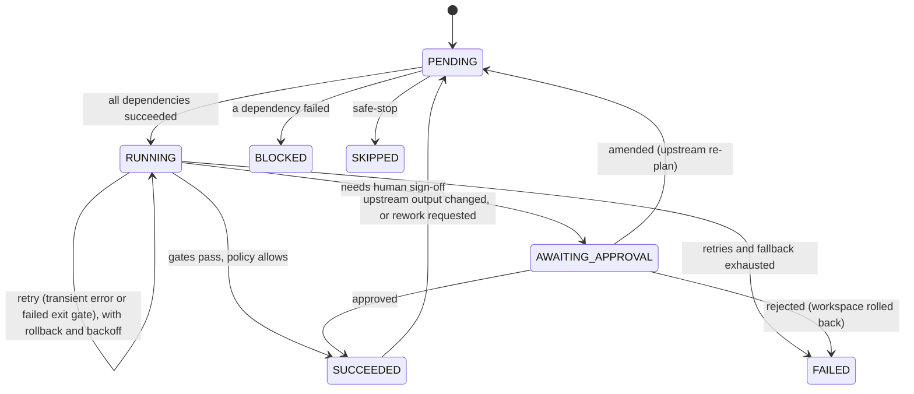

# SDLC orchestrator: governance core

`sdlc/` runs software-delivery work as an explicit graph of stages (requirements, design, development,
review, QA, security, docs, release). **Agents do the work; the engine decides whether it passes.** An agent
cannot approve itself, skip a gate, bypass a policy or touch its own guardrails.

This document covers the core (graph, engine, policy, approvals, audit, metrics), the agents and the
command-line interface. The end-to-end scenarios that deliver real features are added separately.

## Stage lifecycle



## Control flow

| Mechanism | Behaviour |
|---|---|
| **Dependency graph** | Stages declare `depends_on`; cycles and unknown dependencies are rejected. Independent stages run **in parallel** (thread pool); a stage with several dependencies waits for all of them (synchronisation). Stages that change files are serialised by a workspace lock. |
| **Entry gates** | Artifacts that must exist before a stage starts (e.g. development needs `design`). |
| **Exit gates** | Named checks the agent must report as passed (e.g. `tests_pass`). A missing check counts as failed. |
| **Bounded retries** | Transient errors and failed gates retry up to `max_retries`, with exponential backoff; the feedback (gate failures, policy violations) is given to the next attempt. |
| **Fallback** | A non-retryable agent error switches to the stage's `fallback_agent`. |
| **Rollback** | Every file-changing stage is snapshotted in git; failed attempts, rejections and invalidations reset to the snapshot. |
| **Rework** | Review or QA can send work back to development (bounded by `max_rework`); everything downstream is reset. |
| **Re-planning** | If a stage's output changes, completed downstream stages are invalidated and re-run. Agents can propose new stages (e.g. a migration review when a schema change is designed); the engine validates and wires them in. A human can **amend** an upstream stage's inputs at any approval. |
| **Safe-stop** | Kill switch (`STOP` file in the run folder), wall-clock budget, failure budget, and failure of any critical stage. Running work finishes, file changes are rolled back, state is persisted. |
| **Pause / resume** | A missing approval decision pauses the run with state saved; `resume` re-asks and continues. |

All state transitions happen on one coordinator thread, so the state machine stays deterministic even
when agents run in parallel. Every reset bumps the stage's **generation**; a result from a run that started
under an older generation is stale and is discarded (its file changes rolled back), and the stage runs again.
This is what guarantees, for example, that a human amendment made while a stage is still running is never
lost to that run's outdated result. Workspace rollbacks and commits take the same lock that file-changing
stages hold, so they never interleave with a stage that is writing.

## Human approval

Stages marked `requires_approval` or `impact: high`, any policy **escalation**, and any agent that asks
for escalation stop at an approval checkpoint (`<stage>#<round>`). Decisions are **approve**, **reject**
(rolled back), **amend** (re-plan upstream) or **pending** (pause). There is no default approval: an
absent or unsigned decision is pending.

## Policy guardrails

Evaluated by the engine on every attempt, on everything a stage produced:

| Rule | Category | Outcome |
|---|---|---|
| SEC-001 `eval`/`exec`/`os.system`/`pickle.loads`, `subprocess(..., shell=True)` | security | block |
| SEC-002 hard-coded secrets (keys, tokens, private keys) | security | block |
| SEC-003 SQL built with f-strings, `%`, `+` or `.format()` | security | block |
| CMP-001 personal data (client IP, email, password...) in log calls | compliance | block |
| CMP-002 user stories without acceptance criteria | compliance | block |
| CMP-003 design without threat model, data retention, API or decisions | compliance | block |
| CHG-001 changes to `sdlc/` (the agents' own guardrails) or `.git` | change control | block |
| CHG-002 changes to this codebase's security boundaries: `urlshort/storage.py` (schema), `urlshort/config.py` (production checks, secrets), `urlshort/web/clientip.py` (proxy trust), `urlshort/web/middleware.py` (security headers), `Dockerfile`, `.github/workflows/*`, dependency and gate configuration | change control | human approval |
| CHG-003 changes outside the approved impact scope | change control | human approval |
| CHG-004 deleting tests | change control | block |
| CHG-005 large changes (files or lines; generated files excluded) | change control | human approval |

A **block** fails the attempt and rolls back; the violations become feedback for the retry. An
**escalation** succeeds only with a named human's approval.

## Audit and metrics

- **Audit log** (`runs/<run>/audit.jsonl`): every event (stage start, attempt failure, rollback, policy
  outcome, approval with approver name, re-plan) as one JSON line, each storing the SHA-256 of the previous
  line. `verify` detects any edit, deletion or reordering.
- **Lineage:** every artifact records the artifacts it was derived from, so a code change traces back to
  the design and requirement behind it. Decisions are recorded with rationale and decider.
- **Metrics:** attempt success rate, retries, rollbacks, fallbacks, reworks, retry and rollback
  frequency, MTTR (time from a stage's first failure to its recovery) and end-to-end latency.

## Agents

Each agent does one stage's work and communicates only through versioned artifacts in the shared context.
They run **offline and deterministically**: requirements and design use a domain catalog
(`sdlc/agents/catalog.py`), and development applies reviewed change plans (`scenarios/changes/<feature>.py`),
optionally replaying recorded flawed first drafts so the gates can be shown catching them. QA, security and
docs do real work on the real code. LLM-backed agents are planned behind the same contract and gates.

| Agent | Output | What it actually does |
|---|---|---|
| `requirements` | `requirements` | Stories with acceptance criteria (IDs matching the tests); flags vague terms and escalates assumptions or open questions; existing features become regression-only |
| `impact` | `impact` | Parses the code (AST): symbols, imports, routes with their router prefixes, tables; reverse import closure; the approved change scope for CHG-003 |
| `design` | `design` | Components, API contract (or "unchanged" for cross-cutting work), data model, ADRs, STRIDE threat model, retention; proposes a `migration_review` stage when the schema changes |
| `migration` | `migration_plan` | Forward and rollback DDL; checks the change is additive (backward compatible) |
| `development` | `code_change` | Applies change plans with one conventional commit per story; refuses ambiguous patch anchors; can materialise an exact baseline from a git ref (never the working tree) |
| `review` | `review_report` | Static review of every changed file; high findings send work back (rework); tracks findings resolved across rounds |
| `qa` | `qa_report` | Runs the real test suite with coverage; traces every acceptance criterion to a passing test; defects go back to development, infrastructure failures are retried |
| `security` | `security_report` | Policy scan of the whole codebase and dependency pinning |
| `docs` / `docs_static` | `docs` | API reference from the live OpenAPI spec and a changelog; static fallback reads routes from source |
| `release` | `release` | Readiness checklist (artifacts, review, tests, coverage, ACs, security, audit chain); the tag is applied only after human approval |

## Command line

```bash
python -m sdlc.cli run scenarios/<name>.json --approvals scenarios/approvals/<name>.json [--run-dir DIR]
python -m sdlc.cli resume <run-dir> --approvals <decisions.json>     # or --interactive
python -m sdlc.cli stop <run-dir> --reason "incident"                # kill switch: safe-stop
python -m sdlc.cli verify <run-dir>                                  # check the audit hash chain
python -m sdlc.cli promote <run-dir> --approver "<name>" [--target <repo>]
```

Exit codes: `0` completed, `3` paused for approval, `1` failed or stopped, `2` audit chain broken.
Each run writes `run-report.md` (graph state, approvals, policy results, re-plans, lineage, metrics,
timeline), `metrics.json`, `audit.jsonl`, `state.json` and versioned `artifacts/`.

`promote` is the human-gated step that brings a run's commits into a repository. It refuses unless the
run completed, the audit chain verifies, and the target has no uncommitted changes; a conflict aborts and
leaves the target untouched; the promotion itself is recorded in the run's audit log with the approver.

## Quality bar

The orchestrator is held to the same gates as the service: ruff, `mypy --strict`, 100% line and branch
coverage, and bandit at medium severity and above. The only accepted low-severity findings are importing
and calling `subprocess` to run git, which uses argument lists, no shell, and an absolute executable path.
